# 🚀 Codezy — Developer Solution Management & Social Coding Platform

<p align="center">

**Codezy** is a full-stack developer platform designed to help programmers **store, organize, discover, share, and discuss coding solutions** in one centralized place.

It combines **solution management, social interaction, bookmarking, progress tracking, and developer-focused discovery** into a single platform.

</p>

---

## 📌 Table of Contents

- [Problem Statement](#problem-statement)
- [Solution](#solution)
- [Key Features](#key-features)
- [System Architecture](#system-architecture)
- [Application Flow](#application-flow)
- [Technology Stack](#technology-stack)
- [Project Structure](#project-structure)
- [Database Design](#database-design)
- [Authentication & Security](#authentication--security)
- [Core Modules](#core-modules)
- [API Architecture](#api-architecture)
- [Performance & Scalability](#performance--scalability)
- [Installation](#installation)
- [Environment Variables](#environment-variables)
- [Screenshots](#screenshots)
- [Future Improvements](#future-improvements)
- [Contributing](#contributing)
- [License](#license)
- [Author](#author)

---

# Problem Statement

Developers solve hundreds of programming problems across platforms such as competitive-programming websites, interview-preparation platforms, and coding communities.

However, their solutions are often scattered across:

- Different coding platforms
- Local files
- GitHub repositories
- Personal notes
- Browser bookmarks
- Screenshots
- Messaging applications

This creates several problems:

### 1. Difficult Solution Management

Developers often have no centralized location to organize their solutions.

### 2. Difficult Discovery

Finding an old solution based on:

- Problem name
- Difficulty
- Programming language
- Topic
- Coding platform

can become time-consuming.

### 3. Lack of Social Interaction

Traditional coding platforms primarily focus on solving problems rather than allowing developers to build a community around their solutions.

### 4. No Centralized Progress Tracking

Developers need a way to understand their problem-solving activity and progress over time.

### 5. Knowledge Gets Repeated

Developers frequently solve problems that others have already solved, but useful approaches and explanations are not always easy to discover.

---

# Solution

**Codezy** provides a centralized developer-oriented platform where users can:

> **Store → Organize → Discover → Share → Discuss → Track**

their coding journey.

Instead of maintaining solutions across multiple disconnected systems, Codezy provides a single platform for managing coding knowledge and interacting with other developers.

---

# Key Features

## 🧠 Solution Management

Users can create and manage coding solutions with information such as:

- Problem title
- Problem description
- Solution code
- Programming language
- Difficulty
- Topic
- Coding platform
- Explanation

---

## 🔍 Search & Filtering

Users can quickly discover solutions using:

- Problem name
- Programming language
- Difficulty
- Topic
- Platform

This makes the solution repository easier to navigate as the number of solutions grows.

---

## ❤️ Social Interaction

Codezy provides social functionality around coding solutions.

Users can:

- Like solutions
- Comment on solutions
- View other developers' solutions
- Interact with the developer community

---

## 🔖 Bookmarking

Users can bookmark useful solutions for future reference.

This allows developers to build their own personalized collection of:

- Important problems
- Interview questions
- Interesting approaches
- Frequently referenced solutions

---

## 👤 Authentication

Codezy provides authenticated user functionality including:

- User registration
- Login
- JWT-based authentication
- Protected routes
- User profiles

---

## 📊 Progress Tracking

The platform can track developer activity and provide insights into:

- Number of solutions
- Problems solved
- Languages used
- Topics practiced
- User activity

---

# System Architecture

The application follows a **client-server architecture** with a React frontend communicating with a Node.js/Express backend through REST APIs.

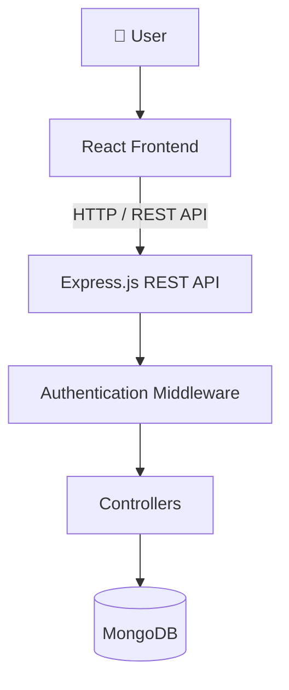

### Architecture Responsibilities

| Layer | Responsibility |
|---|---|
| React | User interface and client-side interaction |
| Tailwind CSS | UI styling |
| Framer Motion | Animations and transitions |
| Express.js | REST API and routing |
| Node.js | Backend runtime |
| Middleware | Authentication and request processing |
| Controllers | Business logic |
| MongoDB | Persistent data storage |
| JWT | Authentication |

---

# Application Flow

A typical request follows the following path:

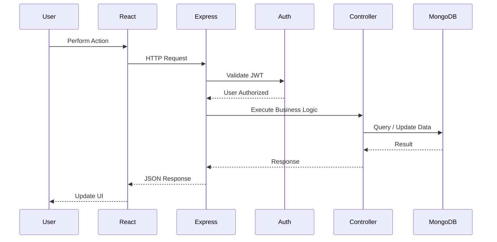

---

# Core Modules

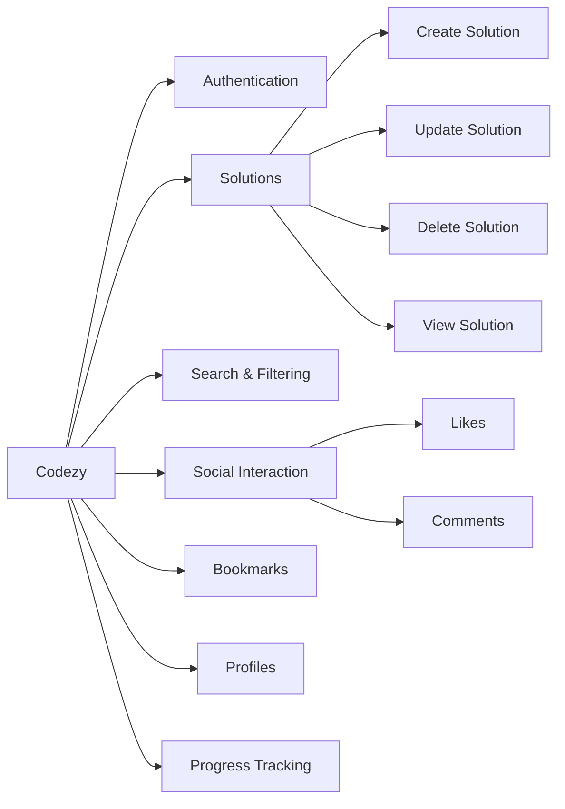

---

# Technology Stack

## Frontend

### React.js

Used for building the component-based user interface.

Benefits:

- Reusable components
- Component-based architecture
- Efficient UI updates
- Large ecosystem

### Tailwind CSS

Used for responsive and utility-based styling.

### Framer Motion

Used to provide:

- Page transitions
- Component animations
- Interactive UI effects

---

## Backend

### Node.js

Used as the server-side JavaScript runtime.

### Express.js

Used for:

- REST APIs
- Routing
- Middleware
- Request handling
- Authentication integration

---

## Database

### MongoDB

MongoDB is used as the primary database because the application's solution data can contain flexible and evolving structures.

MongoDB provides:

- Flexible document structure
- Easy integration with Node.js
- Indexing
- Horizontal scalability
- Efficient document-based storage

---

## Authentication

### JSON Web Tokens (JWT)

JWT is used to authenticate users and protect private API endpoints.

The general authentication flow is:

```text
User Login
    ↓
Credentials Verified
    ↓
JWT Generated
    ↓
Client Stores Authentication State
    ↓
Request Contains JWT
    ↓
Authentication Middleware
    ↓
Token Verified
    ↓
Protected Controller
```

---

# Project Structure

```text
codezy/
│
├── frontend/
│   │
│   ├── components/
│   │   ├── Navbar/
│   │   ├── PostCard/
│   │   ├── Comments/
│   │   └── UI/
│   │
│   ├── pages/
│   │   ├── Home/
│   │   ├── Login/
│   │   ├── Register/
│   │   ├── Profile/
│   │   ├── Bookmarks/
│   │   └── Solution/
│   │
│   ├── store/
│   ├── services/
│   └── App.jsx
│
├── backend/
│   │
│   ├── controllers/
│   │   ├── authController.js
│   │   ├── solutionController.js
│   │   ├── commentController.js
│   │   └── bookmarkController.js
│   │
│   ├── models/
│   │   ├── User.js
│   │   ├── Solution.js
│   │   ├── Comment.js
│   │   └── Bookmark.js
│   │
│   ├── routes/
│   │   ├── authRoutes.js
│   │   ├── solutionRoutes.js
│   │   ├── commentRoutes.js
│   │   └── bookmarkRoutes.js
│   │
│   ├── middleware/
│   │   └── authMiddleware.js
│   │
│   ├── config/
│   └── server.js
│
└── README.md
```

---

# Database Design

A simplified representation of the database relationships:

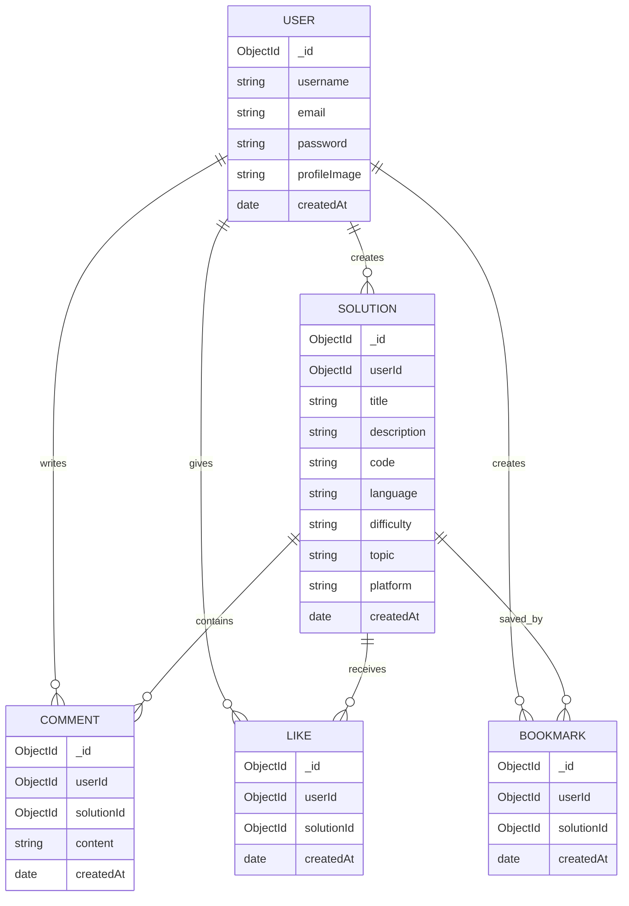

---

# Authentication & Security

Codezy uses JWT-based authentication to protect private resources.

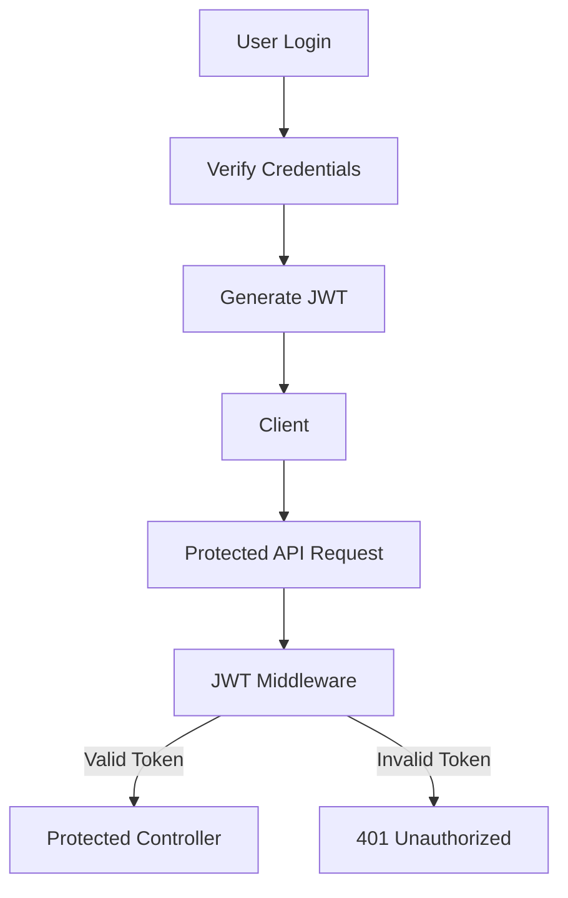

Security considerations include:

- Password hashing
- JWT authentication
- Protected routes
- Input validation
- Authentication middleware
- Environment variables for secrets
- Database-level validation

> Sensitive credentials and secrets should never be committed to the repository.

---

# API Architecture

The backend follows REST principles.

Example endpoint structure:

```text
/api/auth
/api/solutions
/api/comments
/api/bookmarks
/api/users
```

### Example APIs

| Method | Endpoint | Purpose |
|---|---|---|
| POST | `/api/auth/register` | Register user |
| POST | `/api/auth/login` | Authenticate user |
| GET | `/api/solutions` | Fetch solutions |
| POST | `/api/solutions` | Create solution |
| GET | `/api/solutions/:id` | Get solution |
| PUT | `/api/solutions/:id` | Update solution |
| DELETE | `/api/solutions/:id` | Delete solution |
| POST | `/api/solutions/:id/like` | Like solution |
| POST | `/api/solutions/:id/bookmark` | Bookmark solution |
| POST | `/api/solutions/:id/comments` | Add comment |

---

# Performance & Scalability

Codezy is designed with scalability in mind.

## Database Indexing

Indexes can be created for frequently queried fields such as:

```text
title
language
difficulty
topic
platform
userId
createdAt
```

This reduces the amount of data MongoDB needs to scan for common queries.

---

## Pagination

Instead of returning thousands of solutions at once, the API can return data in pages.

```text
Request
   ↓
?page=2&limit=20
   ↓
Backend
   ↓
MongoDB
   ↓
20 Solutions
   ↓
Frontend
```

Benefits:

- Lower network usage
- Faster response times
- Reduced database workload
- Better frontend performance

---

## Search Optimization

As the number of solutions grows, search can be optimized using:

- MongoDB indexes
- Text indexes
- Query optimization
- Pagination
- Caching

---

# 📈 Scalable Architecture

For larger deployments, Codezy can evolve into:

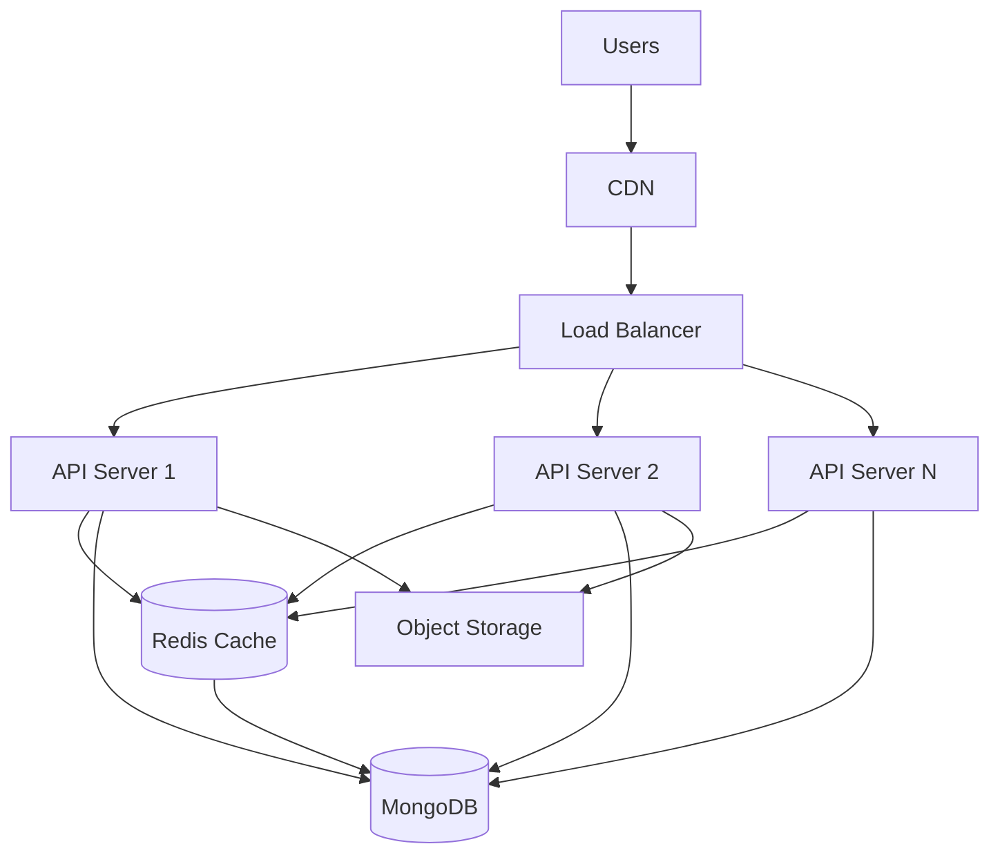

Possible future infrastructure components include:

- Redis
- Load balancer
- CDN
- Docker
- Object storage
- Message queues
- Horizontal backend scaling
- Monitoring and logging

---

# 🧠 Engineering Concepts Demonstrated

Codezy is not just a CRUD application. The project demonstrates several practical software-engineering concepts:

### Frontend

- Component-based architecture
- State management
- API integration
- Responsive UI
- Client-side routing
- Animation

### Backend

- REST API design
- MVC architecture
- Middleware
- Authentication
- Authorization
- Error handling
- Request validation

### Database

- MongoDB schema design
- Relationships using references
- Indexing
- Pagination
- Query optimization

### System Design

- Client-server architecture
- Stateless authentication
- Horizontal scaling
- Caching
- Load balancing
- CDN integration

---

# Screenshots

Add screenshots of the major application pages here.

# 📸 Screenshots

<table>
  <tr>
    <td align="center">
      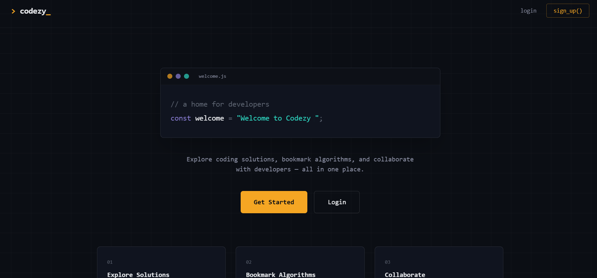
      <br/>
      <b> Password Generator</b>
    </td>
    <td align="center">
      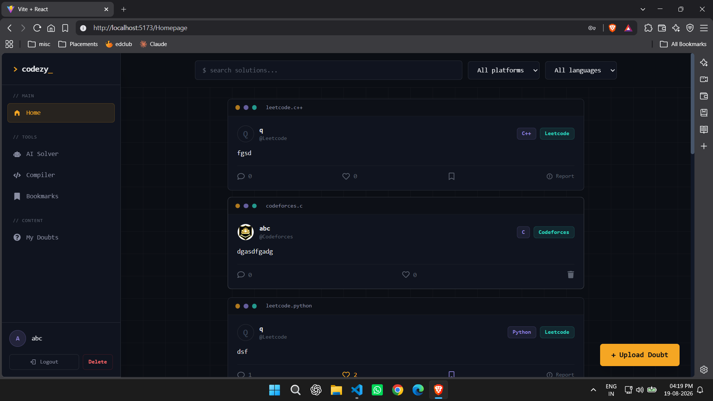
      <br/>
      <b> HomePage</b>
    </td>
    <td align="center">
      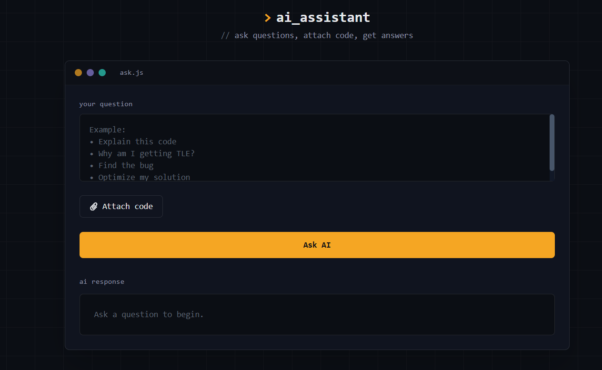
      <br/>
      <b> Ai Doubt Clearer</b>
    </td>
  </tr>

  <tr>
    <td align="center">
      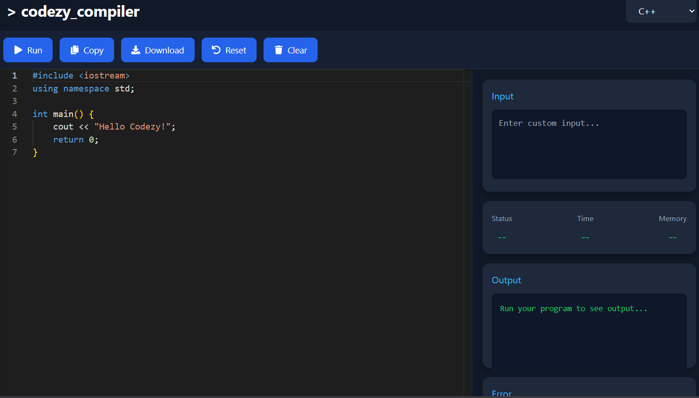
      <br/>
      <b>Compiler</b>
    </td>
    <td align="center">
      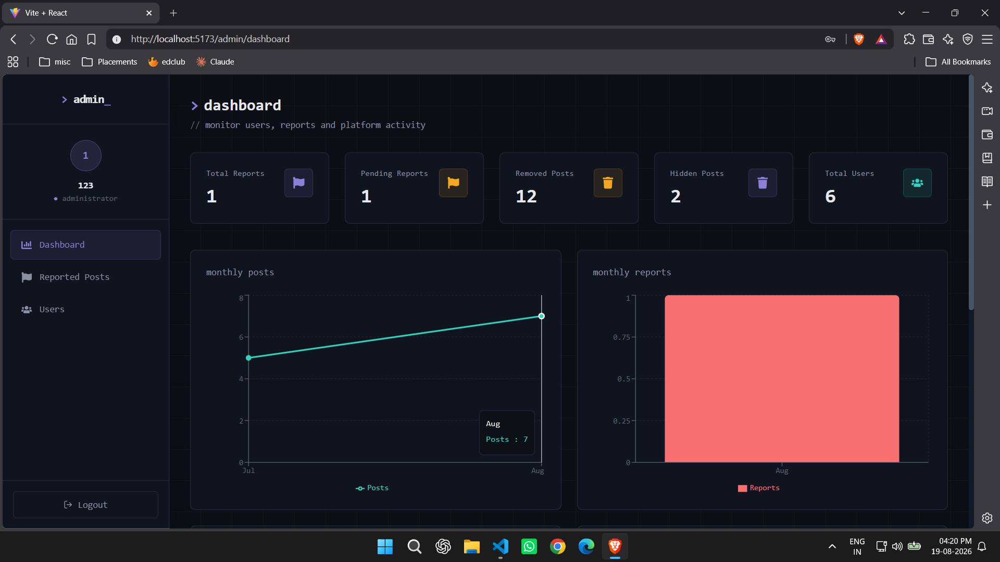
      <br/>
      <b>Admin-Dashboard</b>
    </td>
    <td align="center">
      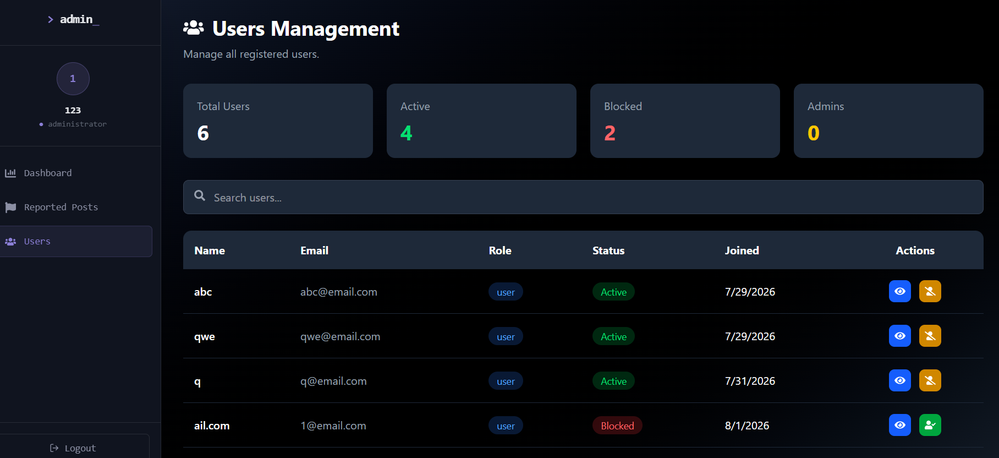
      <br/>
      <b>Admin-Users</b>
    </td>
  </tr>
</table>

# Installation

## 1. Clone Repository

```bash
git clone https://github.com/your-username/codezy.git

cd codezy
```

---

## 2. Install Frontend Dependencies

```bash
cd frontend

npm install
```

---

## 3. Install Backend Dependencies

```bash
cd ../backend

npm install
```

---

# Environment Variables

Create a `.env` file inside the `backend` directory.

```env
PORT=5000

MONGO_URI=your_mongodb_connection_string

JWT_SECRET=your_secret_key
```

Never commit the `.env` file.

Add it to `.gitignore`:

```gitignore
.env
node_modules/
```

---

# Running the Application

## Start Backend

```bash
cd backend

npm start
```

Backend:

```text
http://localhost:5000
```

---

## Start Frontend

Open another terminal:

```bash
cd frontend

npm run dev
```

The frontend will then be available through the Vite development server.

---

# 🧪 Development Workflow

A typical development workflow looks like:

```text
Feature Requirement
       ↓
Frontend Component
       ↓
REST API
       ↓
Express Route
       ↓
Middleware
       ↓
Controller
       ↓
MongoDB
       ↓
JSON Response
       ↓
Frontend State Update
       ↓
UI Update
```

---

# Future Improvements

## 🔥 Online Code Compiler

Integrate an online compiler allowing users to:

- Write code
- Execute code
- View output
- Test solutions

---

## 🤖 AI Coding Assistant

Add an AI assistant capable of:

- Explaining code
- Finding bugs
- Suggesting optimizations
- Generating test cases
- Explaining time complexity

---

## 🏆 Leaderboards

Introduce rankings based on:

- Problems solved
- Contributions
- Likes received
- Community activity

---

## 👥 Follow System

Users will be able to:

```text
Follow Developer
       ↓
View Developer Activity
       ↓
Discover New Solutions
```

---

## 🔔 Notifications

Real-time notifications for:

- Likes
- Comments
- Followers
- Mentions

---

## ⚡ Redis Caching

Frequently requested resources can be cached using Redis.

For example:

```text
GET /api/solutions
        ↓
     Redis
     /   \
   HIT   MISS
   ↓      ↓
Return   MongoDB
          ↓
       Redis
          ↓
        Return
```

---

## 🐳 Dockerization

Containerize the application using Docker:

```text
             Docker
        ┌──────────────┐
        │   Frontend   │
        ├──────────────┤
        │   Backend    │
        ├──────────────┤
        │   MongoDB    │
        └──────────────┘
```

This makes development and deployment more consistent.

---

# Project Highlights

| Area | Implementation |
|---|---|
| Frontend | React.js |
| Styling | Tailwind CSS |
| Animations | Framer Motion |
| Backend | Node.js + Express.js |
| Database | MongoDB |
| Authentication | JWT |
| API | REST |
| Architecture | Client-Server / MVC |
| Search | Filtering + indexed queries |
| Data Management | CRUD |
| Social Features | Likes + Comments |
| Personalization | Bookmarks |
| Scalability | Pagination + indexing |
| Future Infrastructure | Redis + Docker + CDN |

---

# Contributing

Contributions are welcome!

### 1. Fork the repository

```bash
git fork https://github.com/your-username/codezy.git
```

### 2. Create a feature branch

```bash
git checkout -b feature/your-feature
```

### 3. Commit changes

```bash
git commit -m "Add your feature"
```

### 4. Push changes

```bash
git push origin feature/your-feature
```

### 5. Create a Pull Request

---

# License

This project is licensed under the **MIT License**.

---

# Author

## Sanchit Virdi

**Computer Science & Engineering**

NIT Srinagar

Codezy was built as a full-stack project to explore modern web development, REST API architecture, database design, authentication, and scalable system design.

---

# ⭐ Support

If you find **Codezy** useful, consider giving the repository a ⭐.

```text
Built with ❤️ for developers who love solving problems.
```
