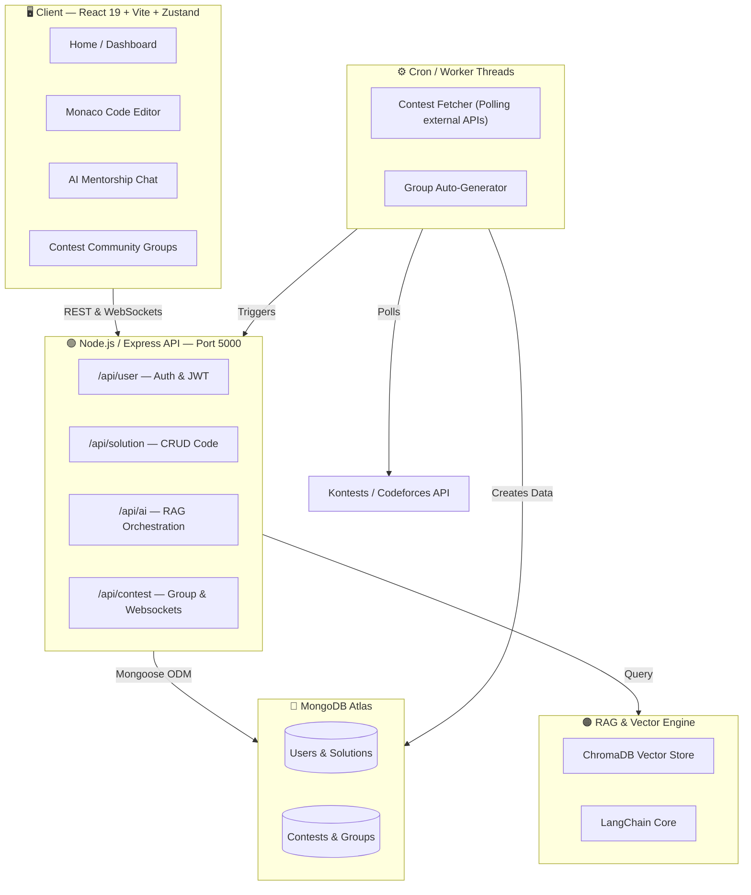
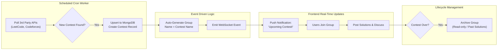
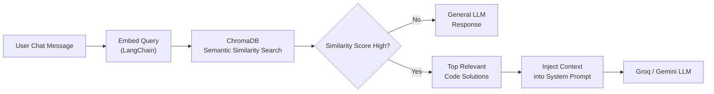
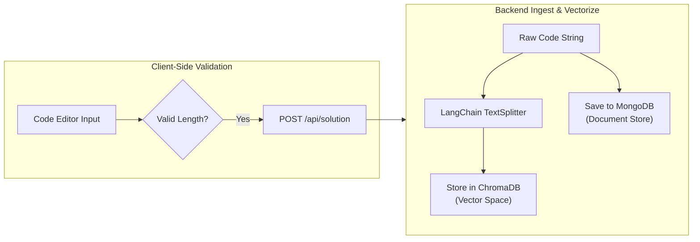
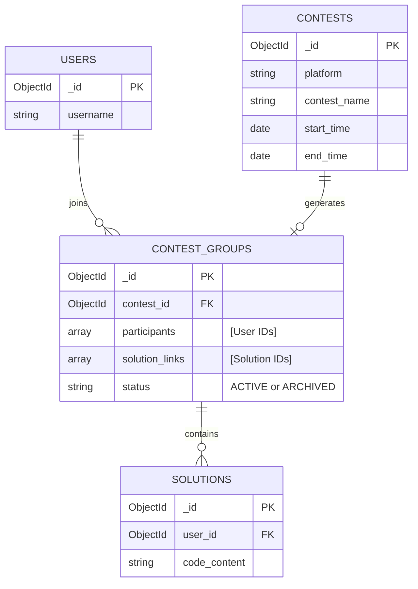

# 🤖 Codezy: AI-Powered Code Solution & Mentorship Platform

A highly scalable, AI-integrated code learning and solution platform built as an Intensive System Design & Full-Stack Architecture Project. This project serves as a comprehensive demonstration of designing production-ready backends, integrating Large Language Models (LLMs), building Retrieval-Augmented Generation (RAG) pipelines, managing complex frontend editor states, and implementing **event-driven background architectures**.

---

## 🏗️ System Architecture



---

## 🔄 End-to-End Workflows

### Contest Notification & Group Auto-Generation Pipeline 🆕

To foster a community of competitive programmers, Codezy utilizes a background event-driven architecture to track coding contests and automatically spin up discussion groups.



---

### AI Mentorship — RAG Query Pipeline



---

### Code Solution — Ingestion Pipeline



---

## 🗄️ Database Schema



---

## 📂 Project Structure

```text
Codezy/
├── frontend/                        # React + Vite Client
│   ├── src/
│   │   ├── components/
│   │   ├── pages/                   # Route pages (Home, Editor, Chat, Contests)
│   │   ├── store/                   # Zustand global state (editor, user)
│   │   └── App.jsx                  
│   └── package.json
│
├── backend/                         # Node.js + Express Server
│   ├── ai/                          # LLM Providers and Prompt templates
│   ├── controllers/                 
│   ├── middlewares/                 
│   ├── models/                      # User, Solution, Contest, ContestGroup
│   ├── rag/                         # LangChain workflows & ChromaDB setup
│   ├── routes/                      
│   ├── workers/                     # Cron jobs for external APIs
│   ├── sockets/                     # WebSocket implementation
│   ├── index.js                     
│   └── package.json
│
└── README.md                        
```

---

## 📝 Interview Concept Cheatsheet

- **How do you track and update contests?** "I implemented an event-driven background worker using Node-Cron that polls APIs like Kontests. It upserts the data into MongoDB, completely decoupled from the main thread so user API requests aren't slowed down."
- **How are users notified of contests?** "Instead of the client polling the server, which is inefficient, I used WebSockets (Socket.io). When the worker saves a new contest, the backend emits a real-time event to all connected clients."
- **What happens to the group when the contest ends?** "The automated worker triggers a state change in the database when `current_time > contest.end_time`. The group status flips to ARCHIVED, turning it into a permanent historical record where users can still view the posted solutions for that specific contest."
- **Why RAG?** "Instead of fine-tuning a model (which is static), we perform a semantic search in ChromaDB to find relevant past solutions, then append that context to the prompt before asking the LLM."
